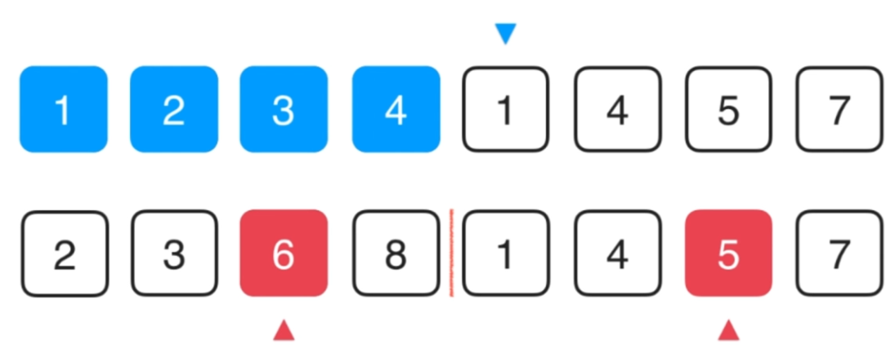
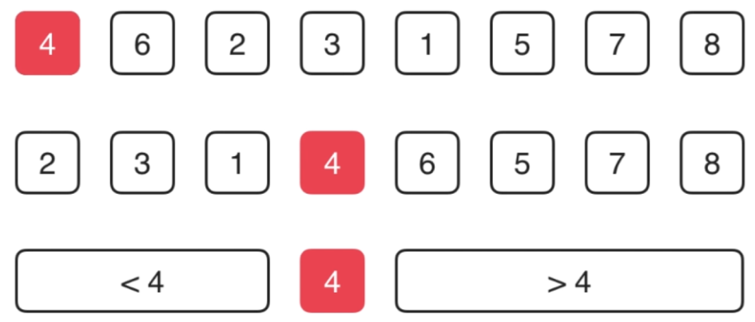

## 数据结构笔记

#### **1. 排序算法**

- 选择排序算法

	- 原理

		每次选择最小值向前排
        
        - step 1 选择最小值
        
        - step 2 交换
        
        - step 3 循环往复
        
        
- 插入排序

	- 原理

		将数组看成两部分，前一部分有序，后一部分无序，依次从后一部分取出一个数字，插入到之前有序的数组中。
        - step 1 拷贝待插入的元素副本
        
        - step 2 找到带插入元素的位置，进行插入
		
	
    - 实现注意

		- 使用赋值替代交换，有利于优化
		- 由于提前终止条件，**有利于近乎有序的数组排序**

- 归并排序算法

	- 原理
		- step 1 数组递归划分到最小问题
			
        
        - step 2 对小问题进行归并排序

			
            
            - merge 过程

				
                
    - 优化方法

		- 对近乎有序的数组优化
		- 对数组量较小的情形（往往近乎有序），使用插入排序
                
  - 另一种实现方法

	- 自底向上的归并排序，其实是使用迭代替代递归
	- 非常适用于链表的排序
	
    	- step 1 划分数组
		
        - step 2 各自排序
        
        
- 快速排序

	- 思想
		- 选择适当的元素（比如第一个）作为**pivot**，将数组分成大于**pivot**和小于**pivot**两部分
		
    
    - 原理

		- 基本快排方法

			
   
  - 优化1: **pivot**选择

	-  **pivot**选择很可能导致排序数组无法做到**平均分**，极端情形会导致$n^2$的时间复杂度

		
        
    - 解决方案：随机化选择 **pivot**
 
 - 优化2: 含有大量重复元素

	- 同样导致分配不均匀
 	
    	
        
   - 解决方案
		
       1. 双路排序，即使元素相同也交换，保证两边元素数量均衡
		
        
  	 2. 将数组划分为3部分，递归处理不等于v的情形

		
        
        - 等于v的情形

			
        
        - 小于v的情形
			
            
		
        - 大于v的情形

			
            
       - 最后的情形
         
         
         
- 排序算法总结

	 将不稳定排序算法稳定化：给定实例的多种项目的具体排序规则
     