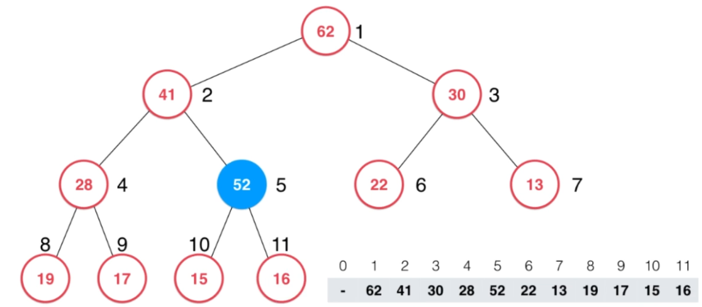

## 堆

- 堆的定义

	- 一棵完全二叉树

		除了最后一层，其他层节点个数最大值（满）
        
        
         
	- 堆中某个节点的值总是不大于其父节点的值

- 基于数组实现的二叉堆（以最大堆为例）

	- 数组与二叉堆的对应关系

	 
     
     	- 索引从1开始
     	- 乘以2获取子节点
     	- 除以2获取父节点

	- 堆的重要操作

		- 向堆中添加元素 -- **Shift Up**

			1. 在数组末尾添加元素

			
            
            2. 更新数组为堆

				不断与父节点元素比较，（大于）交换位置，直到满足堆条件
                
             
             
      - 从堆中弹出根节点元素 -- **Shift Down** 

		 1. 从堆中弹出堆顶元素（获取最大值）
        
         
        
         2. 将最后一个元素放到堆顶
        	
         
         
         3. 不断与子节点比较，（小于）与最大的子节点进行交换，直到满足最大堆条件
          
          
- 堆排序

	- 基于堆的不断获取堆顶元素，可以获取最大（小）元素，时间复杂度为$O(n)$
	- Heapify：将数组存放构建为一个堆

		1. 将数组依据索引映射到二叉堆

		
        
        2. 由于叶子结点本身可以看做一个堆（只有一个元素），因此从第一个非叶子结点开始，使用**shiftUp**和**shiftDown**将数组变成堆
        
        
        
  - 原地堆排序

	基于**heapify**的堆数组进行原地排序
    
    - 由于数组第一个元素是max
    
    
	- 与最后一个元素交换，则橙色部分破坏了堆的性质
	
    
    - 采用**ShiftDown**操作，维护堆，如此往复
 	
- 总结

	- 堆往往作为维护更新的中间数据结构（始终能够获得最值），一般不会单独用作排序

## 索引堆

- 基于索引构建的堆
 
 	- 不改变数组内容，方便按照原来的索引进行查找
 	- 与基本的堆相比，比较的是元素，交换的是索引
  
 - 索引堆的基本操作

	- 修改数组指定index的元素 **change**

		需要找到找到修改index所在堆的index，再进行**shiftDown**或者**shiftUp**操作
        
    - **change**操作的优化

		将数组的index在堆里对应的位置保存下来，方法查找，构建反向查找表
        
        
        - **indexes**中存储的是满足堆的数组index
        - **reverse**中存储的是数组的index索引对应在堆中的位置

