## 二叉搜索树

- 二分查找法

	**对于有序数列才能进行二分查找**
    
    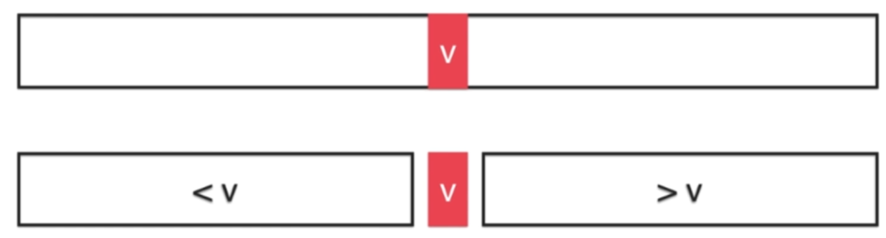
    
    - 实现细节

		- 在$[0,n-1]$的闭区间上进行搜索
		- mid 更新以 mid + 1 或 mid - 1
    
    - 二分查找的变种 
    
    	- 重复元素的查找

			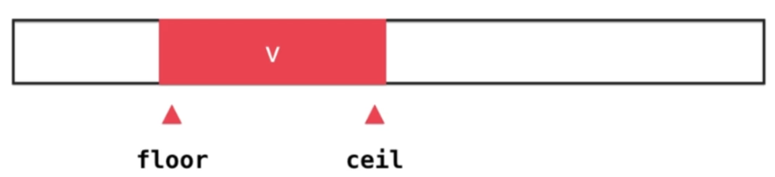
            
            - floor 查找到相同元素的第一个位置
            - ceil 查找到相同元素的最后一个位置
			
		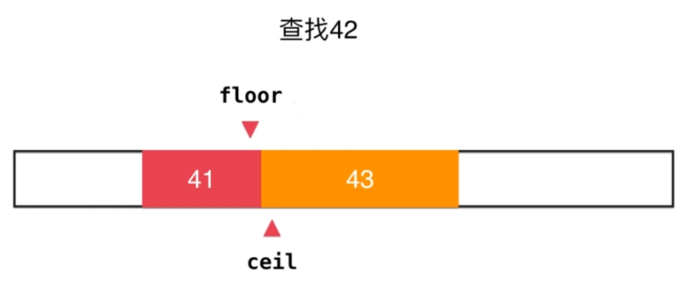
        
        	- floor 查找到元素在数组的下界
        	- ceil 查找到元素在数组的上界	 
		
- 二分搜索树

	- 二分搜索树的优势
		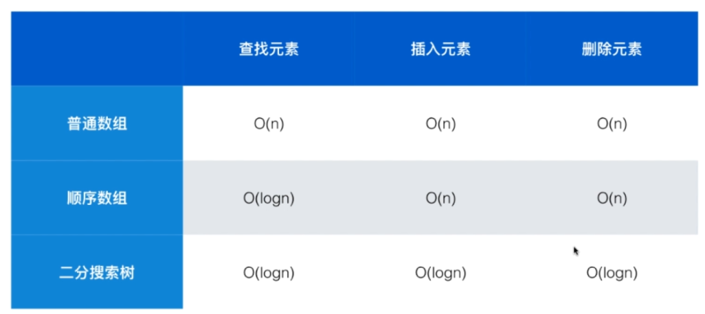
        
        查找**高效**；插入**高效**；删除**高效**
        
    - 二分搜索树的定义

		对于一个二叉树（不一定是完全二叉树），每个节点的键值大于 **left child**同时小于 **right child**，**以左右孩子为根的子树仍为二分搜索树**[可递归]
        
        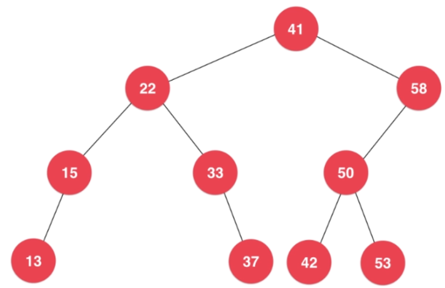
        
  - 二分搜索树的**插入操作**

	- 原树，插入 key 为60 的节点

		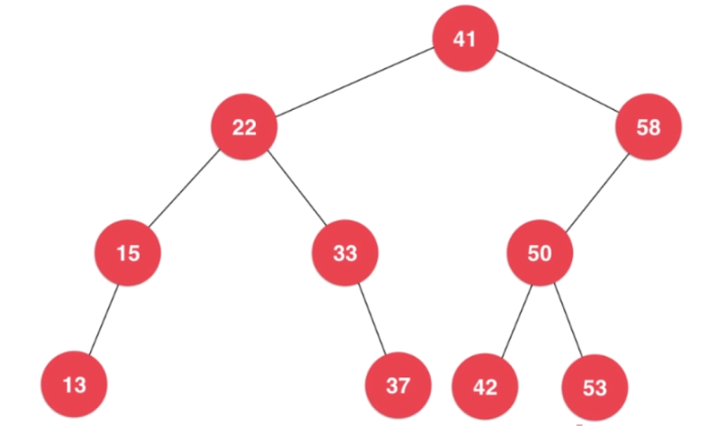
    
    - 将 $60$ 插入 $41$ 为根的树，由于 $60 > 41$，所以需要将 $60$ 插入到 以 $58$ 为根的右子树中[递归]

		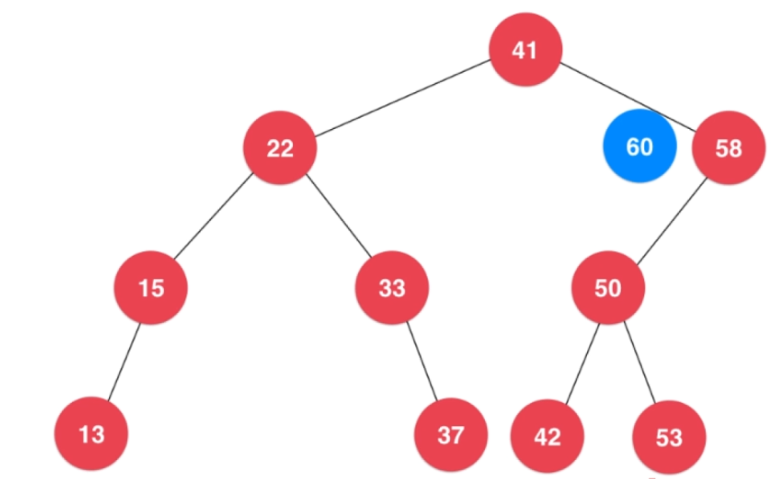
        
    - 直到插入到 $58$ 为根的右子树中，由于右子树为空，则 $60$ 就是右子树的根（递归终结：子树为空）

		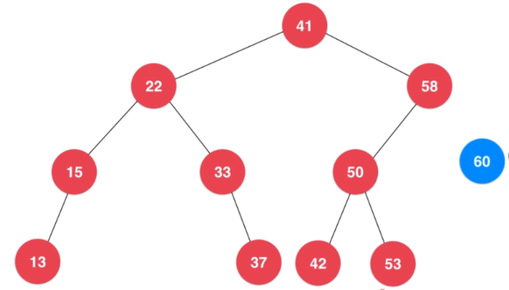
        
    - 将前一层的 根 连接到当前新增的 根

		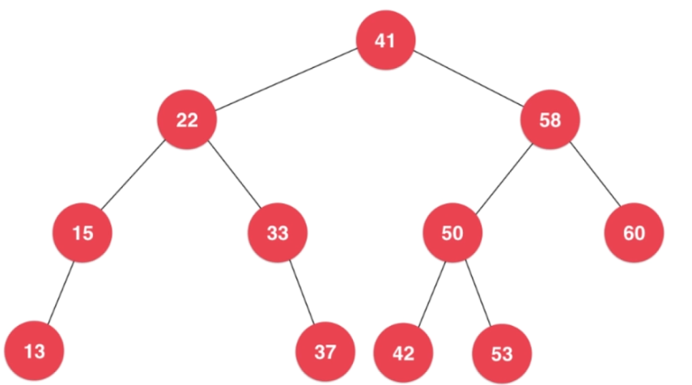

 - 二分搜索树的查找

	思想同于插入操作，只是递归终止条件是**相等则找到，空不存在**
    
 - 二分搜索树的**深度优先遍历**

	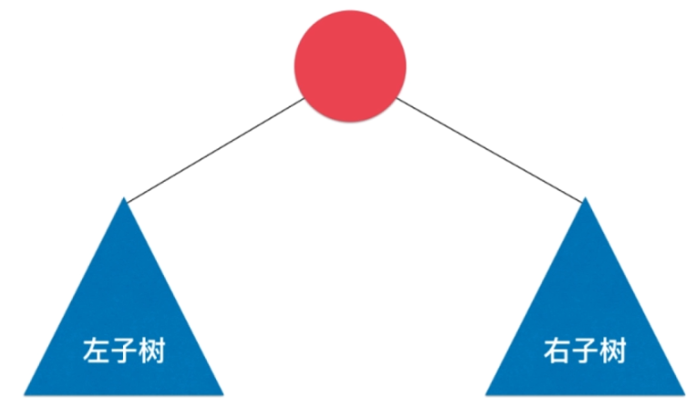

	- 前序遍历（根左右）

		先访问当前节点，再依次递归访问左右子树（只在前序访问到节点时进行操作）
        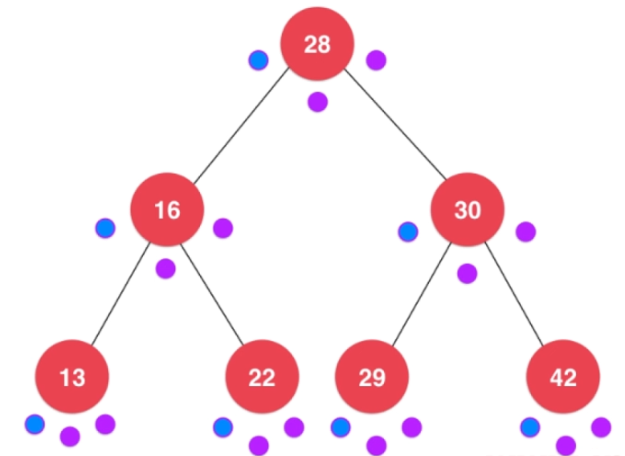
        
        ans：28  16  13  22  30  29  42
    - 中序遍历（左根右）

		先递归访问左子树，再访问自身，再递归访问右子树（只在中序访问到节点时进行操作）
        
        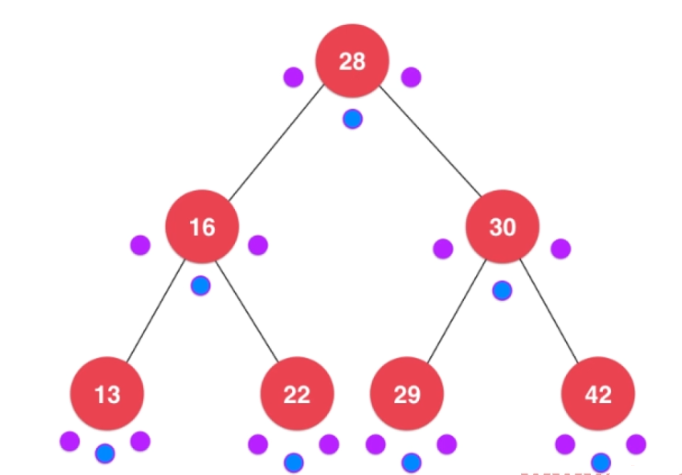
        
        ans: 13 16 22 28 29 30 42 (顺序遍历)
    - 后续遍历（左右根）

		先递归访问左右子树，再访问自身节点 （只在后序访问到节点时进行操作）
        
        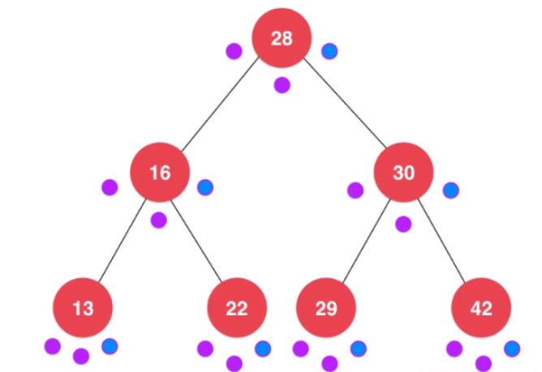
        ans: 13 22 16 29 42 30 28 (后序遍历)
        
  - 二分搜索树的**广度优先遍历（层次）**

	通过队列进行层次遍历，每次出队一个结点，就将该节点的左右子节点压入队列，注意结点压入队列的顺序，就是后面层次遍历的顺序（从左到右或者从右到左），直到队列为空，遍历结束
    
    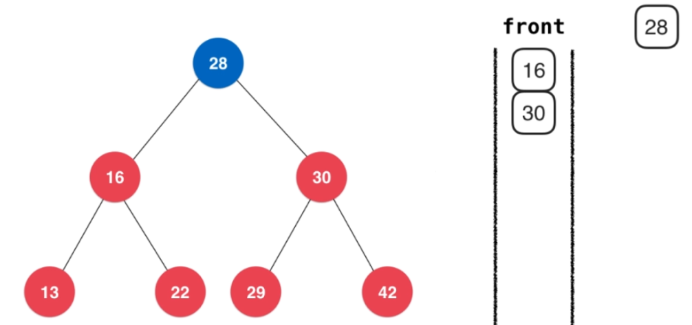
    
 - 二分搜索树的节点删除    
 
 	- 二分搜索树的最小值和最大值删除

		- 查找最小值最大值

			左子树中存在最小值，右子树中存在最大值
            
       - 删除二分搜索树**最小值**
		
        	- 没有孩子节点，直接删除
			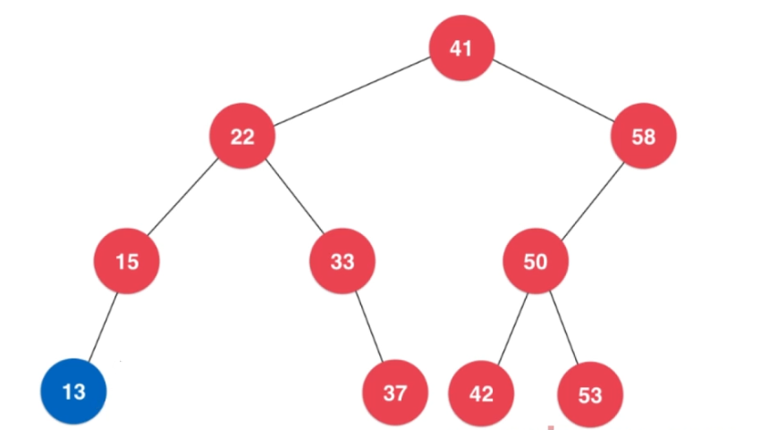
			
            - 存在孩子节点（只会存在右孩子），直接返回右子树的根节点
            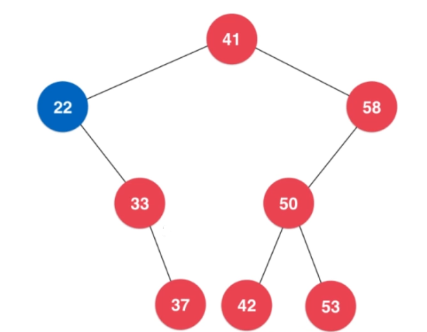
            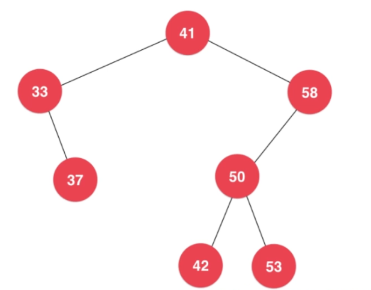
            
       - 删除二分搜索树**最大值**

			- 没有孩子节点，直接删除
			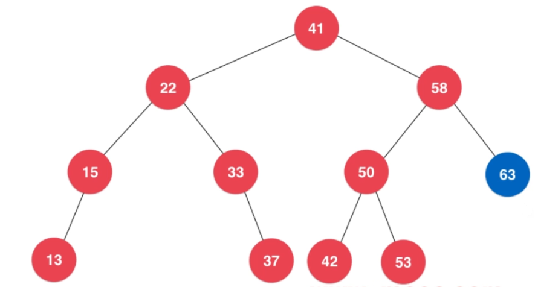
			- 存在孩子节点（只会存在右孩子），直接返回左子树的根节点
			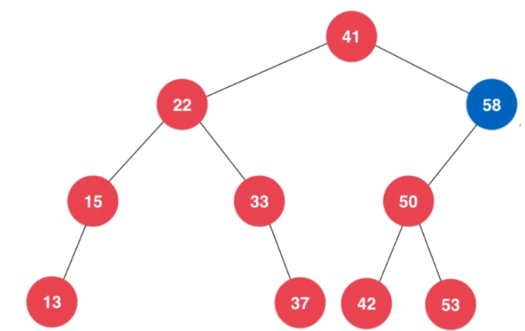
            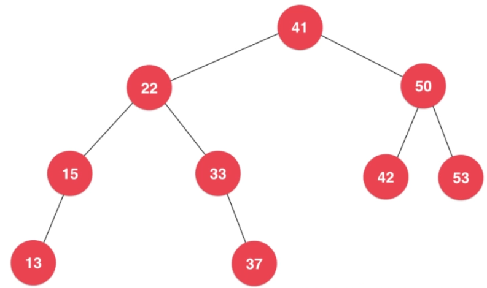
            
   - 二分搜索树删除节点

		- 对于只有一个孩子的节点删除，去另一个子节点作为根节点返回
		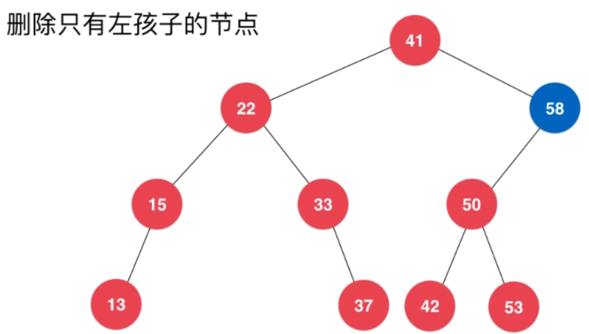
        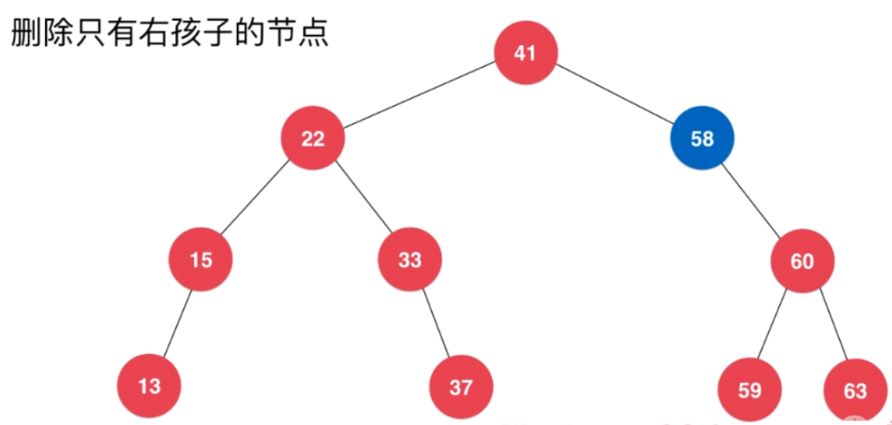
        
        - 对于左右都有孩子的节点
		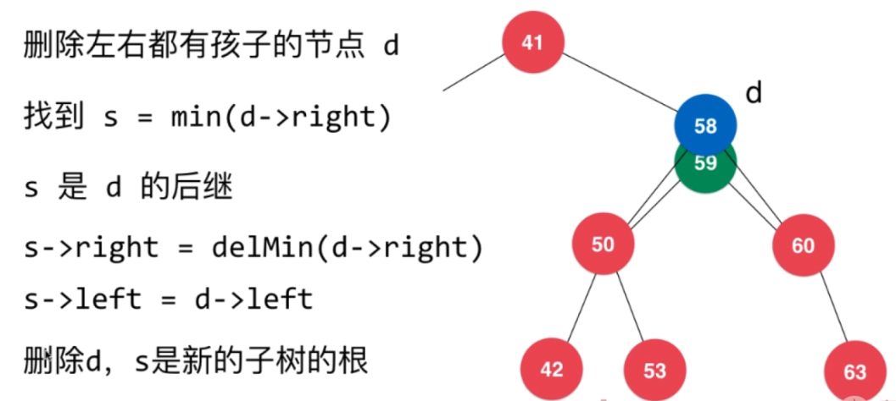
			
- 二分搜索树的顺序性

	- 寻找二分搜索树的最小值与最大值
	- 寻找二分搜索树的前驱节点以及后继节点
	- 查找二分搜索树的 floor 和 ceil 
	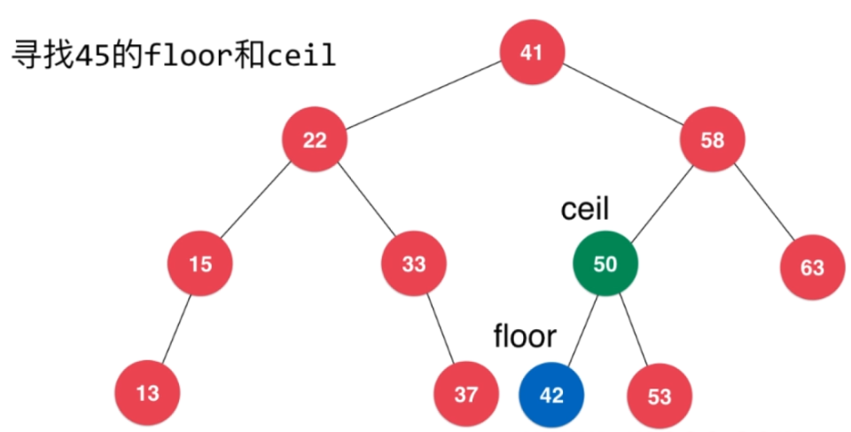
    
    - 二分搜索树的 rank
    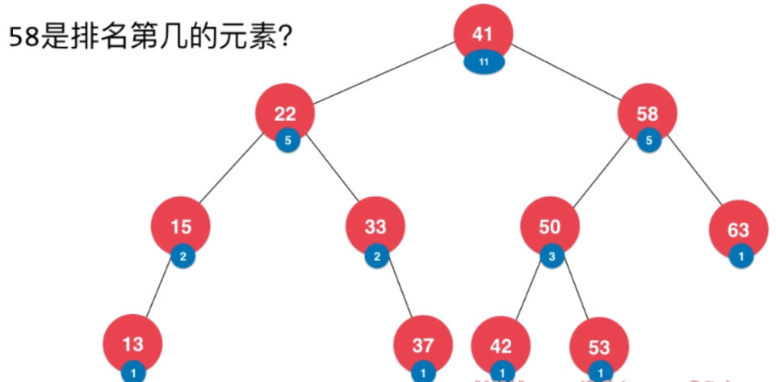
    - 支持重复元素的二分搜索树
	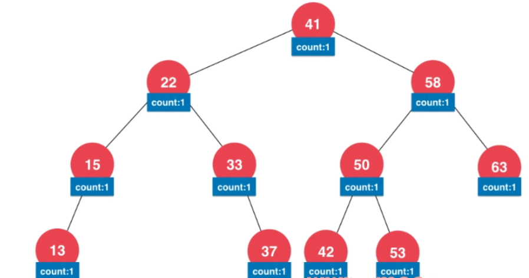
	
- 二分搜索树的局限性

	- 二分搜索树有可能退化成链表 -> 红黑树