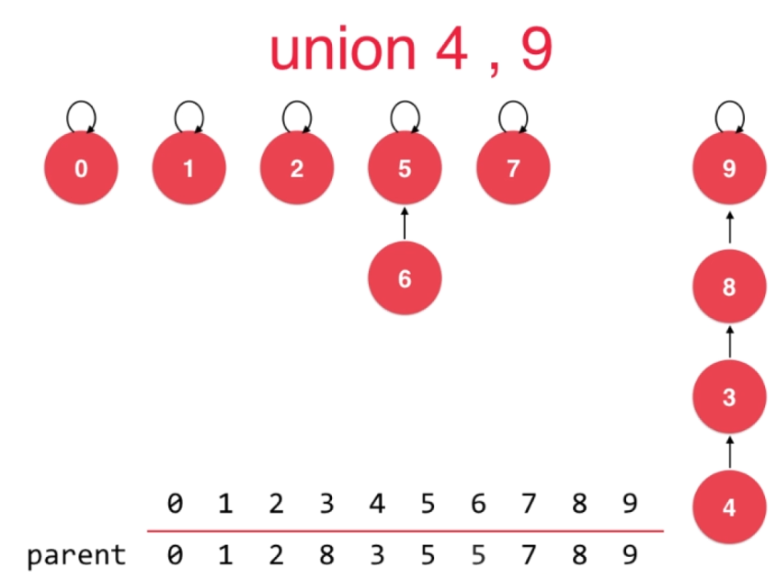

## 并查集

- 并查集的优势

	方便回答连接问题以及路径问题
    
- 并查集的操作

	- 并查集的基本数据表示

		将每一个元素看成一个节点
		
        
    - quick Union

		- 初始数组表示
		
        
        - Union(4,3)
		
		将 $4$ 的 parent 指向 $3$，并修改 parent 数组
        
        
    - find 查找某个节点的 parent
     	
       遍历 parent 数组，直到 parent[p] == p
        
  - 连通性判断

	直接通过 两个节点的 parent 是否相同获得

- 基于size的优化

	- 问题

		
        
        
        不同顺序的Union，会导致产生比较高的树，因此比较有效的做法是**将高度比较少的根节点指向高度比较高的根节点**。
      
- 基于rank的优化      

	- 基于size的问题
	 
     
     
     size 并不能解决树的高度降低
   
   - 基于rank的处理
   		
        rank[i] 表示根节点为 i 的树的高度
   
   
- 路径压缩的优化   

	对于没有直接指向自己根节点的情形，直接指向根节点，加速 find 
	- 问题

	
    
    
    - 算法

		每次查看节点的父节点，如果存在父亲节点，则将该节点的父亲节点指向父节点的父节点，直到父节点是节点本身
	