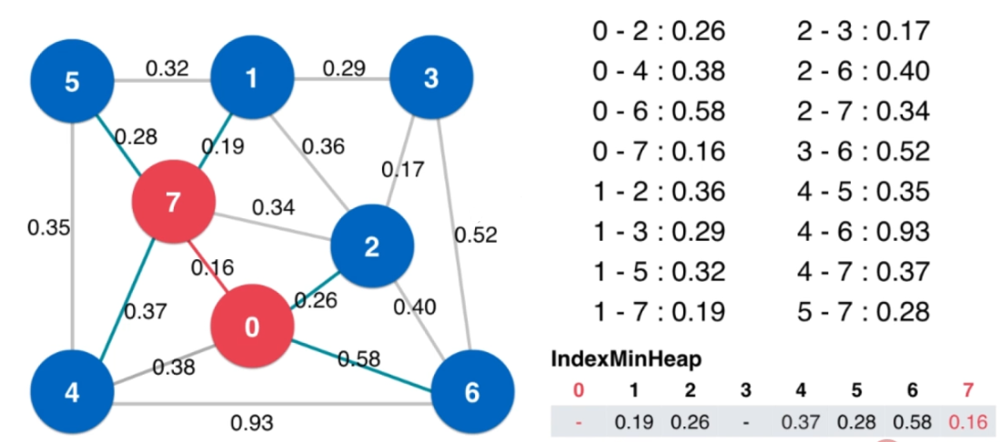

## 图论

- **图论基础**

	- 图的分类
    	
        - 按是否有向分

			无向图、有向图
            
        - 按权分

			无权图，有权图
    - 图的连通性

		
  
- **图的表示**

	- 邻接矩阵（适合表示稠密图）

		- 无向图表示（关于对角线对称）
		
        
        - 有向图表示
        
        
    - 邻接表（适合表示稀疏图）

		- 无向图
		
		
        - 有向图
        
 
- **图的操作**

	- 定点以及边的数量查询
	- 两个顶点是否通过边进行连接
	- 给指定两个点添加边

	- 图的邻边遍历操作

		- 直接遍历查询
		
        
        - 通过迭代器设计

			主要实现 begin();end();next()

	- 图的遍历操作

		- 深度优先遍历

			基于 **stack** 的遍历方式
            - 每次查找当前节点的相邻点
            - 每次在将相邻节点放入之前进行访问判断，未访问过则放入 **stack**
            - 应用
            	- 图的连通分量计算

					对每个节点深度优先遍历，并进行访问标记
            	- 获得从源点到目标点的路径

					基于并查集的思想，记录每个节点
       	
        - 广度优先遍历

			基于 **queue** 的遍历方式
            
            - 对于加入到队列中的节点进行访问标记

			- 应用

				- 无权图的最短路径
            		
- **最小生成树**

	- 有权图

		 
        
        - 邻接矩阵表示法

			 
            
      - 邻接表表示法

		 
   
  - 最小生成树问题和切分定理

	- 最小生成树的问题

		 
        
        - 存在 $V-1$ 条边，连接了 $V$ 个节点
        - 且权重之和最小
        - 针对带权无向图、连通图

	- 切分定理

		- 切分
		 
		如果一个边的两个端点，属于**切分**不同的两边，这个边称为**横切边**。
		 
        
        - 切分定理

			给定任意切分，横切边中权值最小的边必然属于最小生成树。
  - **Prim** 算法

	- Lazy Prim

		- 处理起始点 $0$，将起始点的横切边加入 最小堆，并将起始点 $0$ 标记为红色
		 
		- 从最小堆中获取最小横切边，如果横切边对应的另一节点 $7$ 未被标记为红色，则标记对应节点 $7$ 为红色；否则继续从最小堆中获取新的横切边
		 
		- 将对应节点 $7$ 将对应的横切边，加入堆中
         
        
        - 直到最小堆为空

	- 优化**Prim** 算法

		基于 **IndexMinHeap** 的优化
        
        - 选定初始节点 $0$，并标记
		 
        - 加入 $0$ 的横切边到 **IndexMinHeap** 中
		 	
        - 从 **IndexMinHeap** 中弹出最小的边，并对另一个节点 $7$ 进行标记
		
        - 遍历 $7$ 相邻的横切边，**IndexMinHeap** 进行以下更新
			- 如果相邻边的另一个节点尚未在 **IndexMinHeap** 中，则进行更新
			- 如果相邻边的另一个节点已经在 **IndexMinHeap** 中，在仅当新的横切边小于原有横切边时进行更新
		
        - 继续从 **IndexMinHeap** 中弹出最小的边，重复上述操作
		
        - 直到 **IndexMinHeap** 为空

  - **Kruskal** 算法
	
    - 算法思想
		
        总是寻找较小的边作为最小生成树的边，只要这个边不会在图中形成环。
    
    - 算法流程
        - 对所有边进行排序
        
        - 每次都从边中获取最小权值
        
        - 对形成环的边直接剔除
        
    
    - 关键点
    	
        形成环的判断：采用并查集，查找连通性
        
- 最短路径问题

	 - 无权图最短路径

		
        
        算法：广度优先遍历
        
        其实求出的是 $0$ 到其他点的最短路径（单源最短路径）
     
     - 有权图最短路径

		
        
        算法：
        
        - **松弛操作**
        
        	就是到达当前节点 $1$ 时，需要查看所有能够到达 $1$ 节点的边，看看能够通过其他路径获取更短的路径
  
  - Dijkstra 单源最短路径算法

	- 前提条件：图中不能含有负权边
	- 算法流程：

		- 以 $0$ 为起点，对所有邻边进行访问，并更新数组
		
        - 以最短边指向的顶点 $2$ 作为下一个起始点,因为通过其他点必然大于此时到达 $2$ 的距离。 （这也就要求图中不能含有负权边）
        
        - 松弛操作：考察顶点 $2$ 到达相邻边的顶点，并更新相邻边更短的距离，从而实现松弛操作
		
        - 以 $2$ 可达的最近路径的点 $1$ 作为下一次访问点，并进行松弛操作，直到所有节点均访问完
		
  - 处理负权边的 Bellman-Ford 算法

	- 拥有负权环，就没有最短路径

		
   	
    - Bellman Ford 算法可以找到没有负权环的单源最短路径，也能给出是否有负权环的判断

	- 如果一个图没有负权环，从一点到另外一点的最短路径，最多经过所有 $V$ 个顶点，有 $V-1$ 条边，否则，存在顶点经过了两次，就存在负权环
    
    - 算法流程：

		- 对所有的点进行 $V-1$ 次松弛操作 
        
        - 以 $0$ 为起点，对可达的终点进行最小权值更新，实质上进行了第一次的松弛操作
        